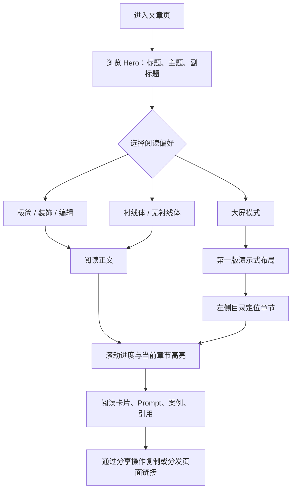

# 02｜设计思路与信息架构

## 设计目标

本项目将一份面向小学教师与大众的 AI 主题演讲稿，转化为适合长时间阅读、课件展示与分享引用的数字长文。设计参照 OpenAI 文章页的阅读秩序，同时保留“人工智能如水”的隐喻表达：界面以白纸、留白、深墨文字与淡蓝水流构成主基调，而不是把视觉装饰置于内容之上。[1] [2]

| 目标 | 设计回应 |
|---|---|
| 清晰传达长篇演讲稿 | 左侧章节目录、右侧主体内容、滚动章节高亮与平滑跳转。 |
| 兼顾克制阅读与作者表达 | 提供极简、装饰、编辑三种视觉模式。 |
| 适配不同阅读习惯 | 将衬线体/无衬线体作为独立控制项，而非固定绑定某种模式。 |
| 服务投影与演讲场景 | 大屏模式复用第一版的白底、衬线、蓝色强调与完整章节节奏。 |

## 视觉规则

| 维度 | 规则 | 具体表现 |
|---|---|---|
| 背景 | 白色优先，纹理克制 | 默认纯白；装饰模式以极低不透明度叠加浅蓝灰水流图。 |
| 字色 | 高对比深墨 | 主文本使用近黑色；辅助文字使用低对比灰色，不牺牲可读性。 |
| 品牌强调 | 深海蓝 `#1E40AF` | Logo、当前目录、章节开场、引用与重点状态，避免大面积铺色。 |
| 字体 | 标题与正文可独立切换 | Noto Serif SC 负责编辑性、仪式感；Noto Sans SC 负责 OpenAI 式理性与紧凑。 |
| 留白 | 节奏优先于填满 | Hero、章节开场、引用块之间设置更大呼吸区，避免连续灰色文本墙。 |
| 图片 | 内容辅助，不代替信息 | 无厚重阴影或夸张圆角；Hero 图作为低对比背景，其他图片按说明文字附近插入。 |

## 视觉模式与字体架构

| 模式 | 核心特征 | 推荐场景 |
|---|---|---|
| 极简 | 黑白灰、无额外背景装饰、最接近参考文章页 | 严肃阅读、打印前审阅、内容优先。 |
| 装饰 | 保留白底结构，在 Hero 区显示淡雅水流背景与 Logo | 网页公开展示、首次阅读。 |
| 编辑 | 更强衬线感、深海蓝章节语言、编辑型长文节奏 | 深度阅读、课程讲义。 |
| 大屏 | 复刻第一版视觉：衬线标题、诗句引言、蓝色章节开场、侧栏目录与全宽布局 | 投影演示、课堂讲解、现场分享。 |
| 字体切换 | 衬线/无衬线的独立覆盖选择 | 满足不同阅读偏好，可与前三种视觉模式组合。 |

## 内容信息架构

文章以“水”作为总隐喻，围绕 AI 智能体的能力变化、教育迁移与安全边界逐层展开。内容被组织为八个可独立跳转的章节。

| 序号 | 章节 | 在叙事中的角色 |
|---:|---|---|
| 一 | 人工智能如水 | 建立“流动、可变、非静态工具”的总隐喻。 |
| 二 | 从聊天框到智能体 | 解释从问答式 AI 到持续行动智能体的变化。 |
| 三 | 模型能力为何会泛化 | 将代码场景中的能力迁移到教育、教研与管理任务。 |
| 四 | 进入小学教师的日常 | 通过课堂与教师工作情境落地。 |
| 五 | 技术门槛正在被水流冲开 | 用开源/技术页面理解展示 AI 如何降低进入门槛。 |
| 六 | Harness Engineering | 将智能体环境、权限、日志、验证机制比作“河道工程”。 |
| 七 | 从写提示词到设计容器 | 将用户的工作重心从单轮指令扩展至目标、材料、边界与反馈。 |
| 八 | 上善若水 | 回收隐喻，形成面向教师使用原则的结尾。 |

每个章节可采用以下内容模块组合：段落正文、名词解释卡、课堂案例、Prompt 示例、重点引用或结语。模块不应机械重复，应由内容密度与理解负荷决定插入位置。[3]

## 用户流程

## 关键交互

| 交互 | 行为 | 用户价值 |
|---|---|---|
| 模式点选 | 点击“极简 / 装饰 / 编辑”立即切换页面视觉皮肤 | 同一内容适配多种审美和工作场景。 |
| 字体点选 | 独立切换衬线体与无衬线体 | 让排版偏好不再被视觉模式绑定。 |
| 大屏切换 | 进入或退出第一版大屏布局 | 让文章可直接用于课堂或投影展示。 |
| 目录跳转 | 点击左侧或移动端目录项，平滑滚动至章节 | 缩短长文定位路径。 |
| 滚动观察 | 根据 scroll 位置更新进度与当前章节 | 保持阅读方位感。 |
| 分享 | 提供页面链接分享入口与反馈 | 支持传播与协作阅读。 |

## References

[1]: [原始 ideas.md](source/original-docs/ideas.md)
[2]: [OpenAI 参考页面链接记录](source/references/01_OpenAI参考页面链接记录.md)
[3]: [模式设计规格原始导出](source/design-docs/modes-design-spec.md)
[4]: [用户参考截图：OpenAI 布局](source/original-input/reference-screenshots/用户参考截图_OpenAI布局.webp)
[5]: [用户参考截图：大屏效果](source/original-input/reference-screenshots/用户参考截图_大屏效果.webp)
