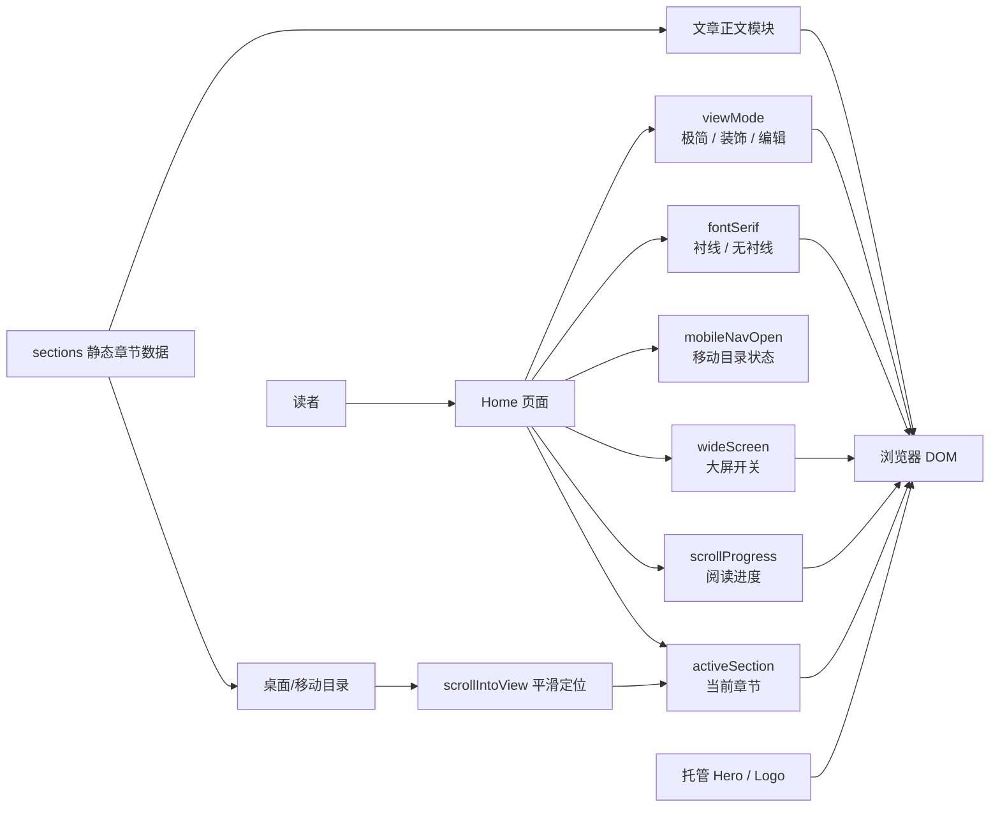
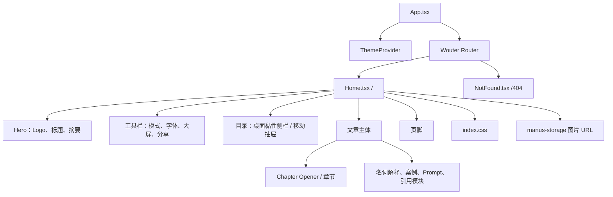

# 03｜项目结构地图

## 技术概览

本项目是前端静态站点：React 19 负责组件渲染，Vite 负责开发与构建，Wouter 提供前端路由，Tailwind CSS 负责样式工具类，Lucide React 提供图标。页面不依赖数据库、后端业务 API 或用户账户；文章内容与章节结构以静态 TypeScript 数据和 JSX 内容保存在页面源码内。[1] [2]

| 层级 | 主要实现 | 职责 |
|---|---|---|
| 应用入口 | `client/src/main.tsx`、`client/src/App.tsx` | 挂载 React、主题容器、Toast、路由与错误边界。 |
| 页面 | `client/src/pages/Home.tsx` | 标题区、工具栏、目录、文章正文、模式状态与滚动逻辑。 |
| 样式 | `client/src/index.css` | 全局色彩 token、字体、阅读与模式样式。 |
| 交互基础 | `wouter`、`sonner`、`lucide-react` | 路由、提示消息、图标。 |
| 素材 | `/manus-storage/...` 与归档 PNG | 页面中的 Hero 与 Logo 使用托管 URL；归档中保留原始 PNG。 |

## 页面、状态与数据流



## 文件结构

```text
人工智能如水_交付资料包/
├── 00_导出说明.md
├── 01_提示词与素材清单.md
├── 02_设计思路与信息架构.md
├── 03_项目结构地图.md
├── 04_References原始文件清单.md
├── source/
│   ├── original-input/
│   │   ├── 演讲稿(1).pdf
│   │   └── reference-screenshots/
│   ├── original-docs/
│   │   ├── ideas.md
│   │   └── todo.md
│   ├── prompt-records/
│   │   └── 01_生图提示词原始导出.md
│   ├── design-docs/
│   │   ├── design-ideas.md
│   │   └── modes-design-spec.md
│   ├── materials/
│   │   ├── hero-water-abstract.png
│   │   ├── logo-water-flow.png
│   │   ├── section-divider-wave.png
│   │   ├── card-bg-water-texture.png
│   │   └── SHA256SUMS.txt
│   ├── chat-records/
│   ├── references/
│   └── test-records/
└── source-code/
    ├── index.html
    ├── client/
    │   └── src/
    │       ├── App.tsx
    │       ├── index.css
    │       └── pages/Home.tsx
    ├── config/
    │   ├── package.json
    │   ├── pnpm-lock.yaml
    │   ├── vite.config.ts
    │   └── tsconfig*.json
    └── first-version-98d47073/
        ├── Home.tsx
        └── index.css
```

## 页面模块关系



## 依赖与接口说明

| 类型 | 名称 | 是否存在外部接口 | 说明 |
|---|---|---|---|
| 框架 | React 19 | 否 | 客户端组件渲染。 |
| 构建工具 | Vite | 否 | 本地开发与前端生产构建。 |
| 路由 | Wouter | 否 | 仅客户端路由；当前主页面为 `/`。 |
| 样式 | Tailwind CSS 4 | 否 | 工具类和全局样式结合。 |
| 图标 | Lucide React | 否 | 本地 npm 依赖提供图标组件。 |
| 图片 | Manus Storage 路径 | 是，静态资源托管 | 仅用于加载 Hero 和 Logo；没有业务数据接口。 |
| 数据库/API | 无 | 无 | 本任务为静态前端，未发现后端数据流。 |

## 构建与验证入口

| 命令 | 用途 | 预期输出 |
|---|---|---|
| `pnpm dev` | 启动 Vite 开发服务器 | 本地预览 URL。 |
| `pnpm check` | TypeScript 无输出检查 | 成功时退出码为 0。 |
| `pnpm build` | Vite 生产构建并打包 server 兼容层 | 生成 `dist/`。 |

## References

[1]: [应用路由源码 App.tsx](source-code/client/src/App.tsx)
[2]: [依赖与命令配置 package.json](source-code/config/package.json)
[3]: [核心页面源码 Home.tsx](source-code/client/src/pages/Home.tsx)
[4]: [全局样式源码 index.css](source-code/client/src/index.css)
